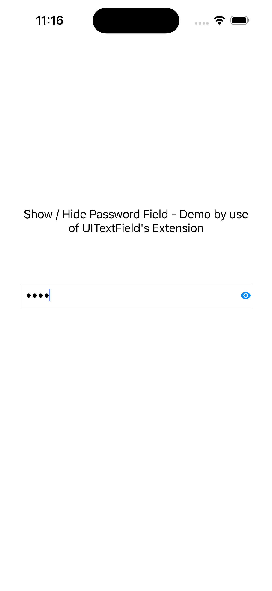
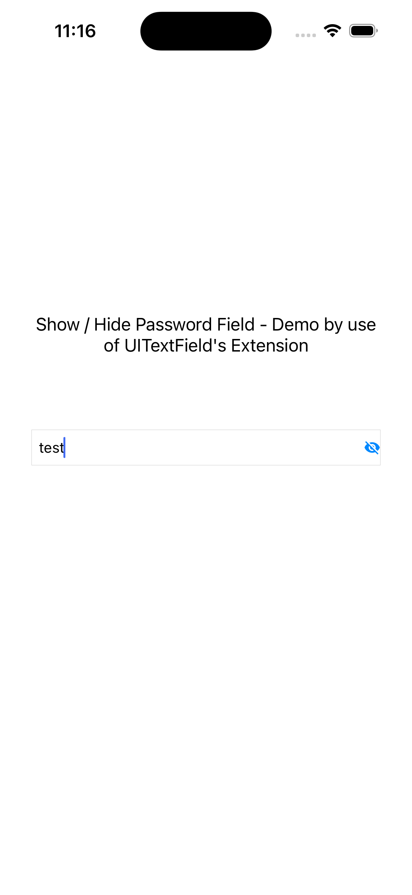

# ShowHidePasswordField

A lightweight iOS demo project that demonstrates how to add a **show/hide password toggle** to a `UITextField` using a clean `UITextField` extension in Swift.

## Features

- Toggle password visibility with an eye icon button
- Reusable `UITextField` extension — drop it into any project
- Uses custom `ic_eye_open` and `ic_eye_closed` image assets
- No third-party dependencies

## How It Works
```swift
self.txtPassword.showEyePasswordField()
```
## Screenshots

| Password Hidden | Password Visible |
|:-:|:-:|
|  |  |

## Requirements

- iOS 13+
- Xcode 11+
- Swift 5

## Usage

1. Copy `UITextField.swift` (the extension file) into your project.
2. Add `ic_eye_open` and `ic_eye_closed` image assets to your `Assets.xcassets`.
3. Call `showEyePasswordField()` on any `UITextField` you want the toggle on.

```swift
import UIKit

class ViewController: UIViewController {
    @IBOutlet weak var txtPassword: UITextField!

    override func viewDidLoad() {
        super.viewDidLoad()
        self.txtPassword.showEyePasswordField()
    }
}
```

## License

This project is available under the MIT License.
